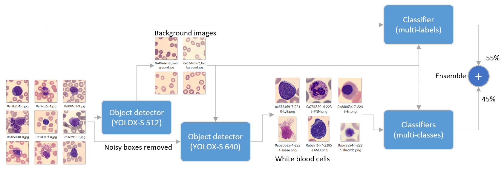

# Cytologia
White Blood Cells detection challenge.

Overview of the solution is available as [PDF document here](https://github.com/MPWARE-TEAM/Cytologia/blob/main/documentation/overview.pdf).


## Folder structure:
You need to copy images from the [challenge](https://app.trustii.io/datasets/1533) into **images_cytologia/** folder. Training notebooks below will generate intermediate parquet/csv files. Output file of a notebook is used as input of other notebooks. 

    ├── README.md
    │
    ├── data
    │   ├── images_cytologia
    │   ├── train.csv
    │   └── test.csv
    │
    ├── notebooks <- Training/inference notebooks
    │
    ├── code <- Related code used by notebooks
    │   ├── src
    │   ├── src_object_detector <- YOLOX fork
    │   └── requirements.txt
    │
    ├── yolo_models <- Materials for object detection (YoloX)
    │
    ├── models <- Materials for classifier
    

## Environment
Install all python 3.10 dependencies:
```bash
cd code/
pip install -r requirements.txt

cd src_object_detector/YOLOX/
pip install -v -e .
```

## Inference 
Run the following notebook:
- **[Full-Inference.ipynb](https://github.com/MPWARE-TEAM/Cytologia/blob/main/notebooks/Full-Inference.ipynb)**. Run all trained models on test data. It takes around 2h40 for 20751 images (462ms per image) with a single standard GPU (RTX3090). [Download](https://cytologia.s3.amazonaws.com/submission_inference_6.zip) ready-to-use full package (including the same notebook named as FULL-INFERENCE-v6.ipynb) with weights for all trained models. You need to copy images from the [challenge](https://app.trustii.io/datasets/1533) into images_cytologia/ folder before running it. This package is the one uploaded for the winning submission.

## Training
Run the following notebooks in the given order. You need to copy images from the [challenge](https://app.trustii.io/datasets/1533) into data/images_cytologia/ folder before running.


1 - **Cross-Validation.ipynb**. Clean up duplicated data and generate cross-validation split. It generates two files:
  BB_cleaned_v1.parquet (cleaned data) and cv4_seed42_multilabel.parquet (cross validation split). It takes around 30 minutes to run.

2 - **Train-YOLOX-S-512.ipynb**. Train first YOLOX model based on train data. Download [YOLOXs COCO weights](https://github.com/Megvii-BaseDetection/YOLOX/releases/download/0.1.1rc0/yolox_s.pth) first and copy yolox_s.pth into code/src_object_detector/YOLOX folder. It will generate COCO structure under yolo_models/ folder and weights under code/src_object_detector/YOLOX/YOLOX_outputs folder. Training takes around 80 hours (150 epochs) with a single standard GPU (RTX3090).

3 - **Infer-YOLOX-S-512.ipynb**. Infer YOLOX-S-512 model. It will generate cv4_seed42_multilabel_oof_yolox_s_512_v3.1.parquet file used by the next notebook. It takes around 2 hours.

4 - **Background images.ipynb**. Generate background images from YOLOX model and OTSU filter. It will generate background images used by next notebooks under data/background folder. It takes around 10 minutes to run.

5 - **Train-YOLOX-S-640.ipynb**. Train second YOLOX model based on train data with noisy boxes removed. It will generate COCO structure under yolo_models/ folder and weights under code/src_object_detector/YOLOX/YOLOX_outputs folder. It takes around 70 hours (110 epochs) to train with a single standard GPU (RTX3090).

6 - **Infer-YOLOX-S-640.ipynb**. Infer YOLOX-S-640 model. It will generate boxes/ folder with extracted bounding boxes ready to train some classifiers. It also generates files used by the next notebook. It takes around 2 hours.

7 - **Train-Classifiers**. Train/Finetune/Infer multi-classes and multi-labels models and perform ensemble. Make sure you've downloaded [DinoBloom-B pretrained weights](https://zenodo.org/records/10908163/files/DinoBloom-B.pth?download=1) under notebooks/ folder before running. It will generate models under models/ folder. It takes around 170 hours to train with a single standard GPU (RTX3090).

8 - **Full-Inference**. Infer YOLOX models followed by classifiers models. Update DATA_ROOT and MODELS_HOME if you run it from notebooks/ folder. Runtime durations available.

**Note**: Training times estimation given above are for:
- A single standard GPU (NVidia RTX3090/24GB-VRAM), CUDA Version: 12.6.
- 64GB RAM, IntelCorei9, 10 CPUs, SSD Disk.
- Linux Ubuntu 22.04.3 LTS (GNU/Linux 5.15.167.4)/WSL2, Python 3.10.
- The random seed is fixed to 42, 100% reproducibility is not guaranteed as certain operations (e.g., [PyTorch](https://pytorch.org/docs/stable/notes/randomness.html)/torch.nn.functional, DinoV2/Xformers) may still have nondeterministic behavior due to hardware and low-level implementation differences. However, final results should be very close.


## Models weights
You can download each model's weights (result of the CV4 trainings above) if needed. Intermediate results (cross-validation, inference, submissions) all included.

| Model                                                | Image size | Weights                                                                          |
|------------------------------------------------------|------------|----------------------------------------------------------------------------------|
| YOLOX-S-512                                          | 512x512    | [Download](https://cytologia.s3.amazonaws.com/yolox-s-512.zip)                   |
| YOLOX-S-640                                          | 640x640    | [Download](https://cytologia.s3.amazonaws.com/yolox-s-640.zip)                   |
| Multi-classes ViT large (23 classes)                 | 224x224    | [Download](https://cytologia.s3.amazonaws.com/mc_vitl_224_1.2.4.zip)             |
| Multi-classes ViT large with background (24 classes) | 224x224    | [Download](https://cytologia.s3.amazonaws.com/mc_vitl_224_bg_1.2.5.zip)          |
| Multi-classes DinoV2/DinoBloom (23 classes)          | 224x224    | [Download](https://cytologia.s3.amazonaws.com/mc_dinobloom_224_1.4.0.6.zip)      |
| Multi-classes NextViT (23 classes)                   | 384x384    | [Download](https://cytologia.s3.amazonaws.com/mc_nextvit_384_1.2.4_1.4.0.zip)    |
| Multi-classes TinyViT (23 classes)                   | 512x512    | [Download](https://cytologia.s3.amazonaws.com/mc_tinyvit_512_1.5.0.zip)          |
| Multi-classes EffNetV2m (23 classes)                 | 512x512    | [Download](https://cytologia.s3.amazonaws.com/mc_effnetv2m_512_1.2.4_1.4.0.zip)  |
| Multi-labels EffNetV2m with background (24 classes)  | 512x512    | [Download](https://cytologia.s3.amazonaws.com/ml_effnetv2m_512_bg_1.3.0.zip)     |

## Take away
The best submission (with the best CV score) is an ensemble of multiple models. While no formal ablation study was conducted, observations from experiments suggest the following key contributors to improved cross-validation performance:

- A two-stage pipeline: White Blood Cell bounding box detector followed by classifiers.
- Augmentations such as MixUp and CutMix.
- Extended training with more epochs and fine-tuning.
- Test-Time Augmentation (TTA)
- Diverse models architectures (CNN and Transformers)
- Weighted averaging of models in the ensemble.

Further improvements could be achieved by fine-tuning on external datasets like [Peripheral Blood Cell](https://data.mendeley.com/datasets/snkd93bnjr/1), which were not utilized in this work.

## References
- HuggingFace Timm vision models: https://huggingface.co/timm
- DinoBloom foundation models: https://github.com/marrlab/DinoBloom